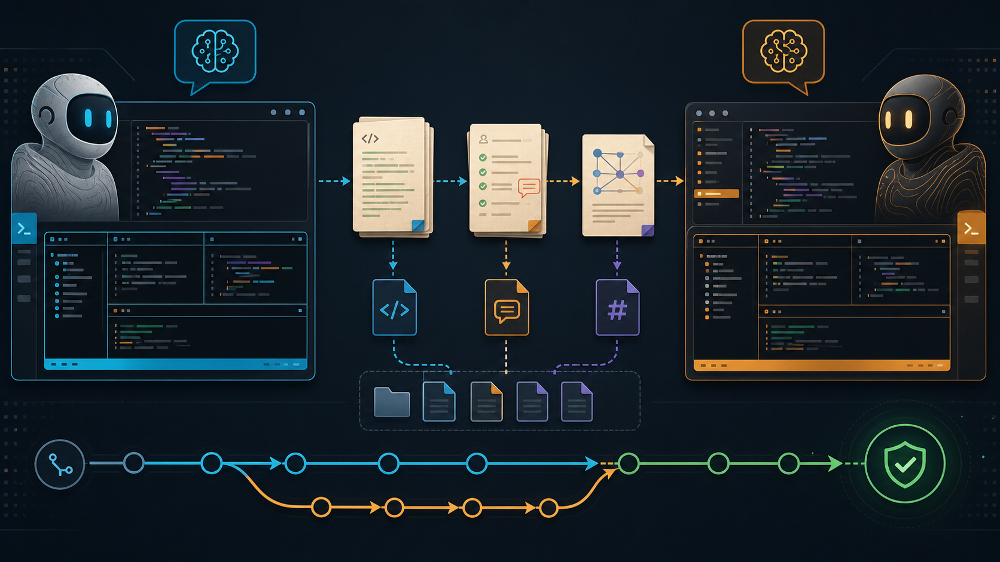

# Codex CC Collaboration Skills

<p align="center">
  
</p>

A compact Codex skill pack for turning a Claude Code session in `tmux` into a verifiable coding, review, and research collaborator.

The core idea is simple: Codex should not rely on a terminal transcript as the source of truth. Requests, review findings, and shared research are written to files, so the handoff can be checked, resumed, and audited.

## What Is Included

| Skill | Use it for | Core guarantee |
| --- | --- | --- |
| `claude-tmux-submit-verify` | Send a message to Claude through `tmux`. | Verifies that Claude actually started working after `send-keys`. |
| `claude-review-loop` | Ask Claude to review a completed code change. | Forces findings to be written to `RESPONSE.md` before Codex proceeds. |
| `codex-claude-shared-research` | Let Codex and Claude jointly investigate one topic. | Keeps both agents' notes and the final conclusion in one Markdown file. |

The default Claude pane is:

```text
agent_claude:0.0
```

## Install

Clone the repository:

```bash
git clone https://github.com/ShuimuChen-hyq/cc-codex-skill.git
cd cc-codex-skill
```

Install all skills into the Codex user skill directory:

```bash
mkdir -p ~/.codex/skills
cp -a claude-tmux-submit-verify ~/.codex/skills/
cp -a claude-review-loop ~/.codex/skills/
cp -a codex-claude-shared-research ~/.codex/skills/
```

Restart Codex after installing. Skills are loaded at session start.

Verify installation:

```bash
find ~/.codex/skills -maxdepth 2 -name SKILL.md -print
```

Expected output:

```text
~/.codex/skills/claude-tmux-submit-verify/SKILL.md
~/.codex/skills/claude-review-loop/SKILL.md
~/.codex/skills/codex-claude-shared-research/SKILL.md
```

## Requirements

- Codex can read `~/.codex/skills`.
- `tmux` is installed.
- Claude Code is already running in a `tmux` pane.
- The default pane is `agent_claude:0.0`.
- Helper scripts use `sudo -n tmux` by default. Make sure the runtime user can run that command without an interactive password prompt, or adapt the scripts for your environment.

## Typical Setup

Start or attach to the Claude pane before asking Codex to use these skills:

```bash
tmux new -s agent_claude
```

Inside that pane, start Claude Code. If your pane target is different, pass `--target` to the helper scripts or update the defaults in the skill scripts.

## Skill Usage

### `claude-tmux-submit-verify`

Use this when Codex needs to send a request to Claude through `tmux` and must verify that the message was really submitted.

This prevents a common failure mode: `tmux send-keys` leaves text at Claude's prompt, but Claude never starts processing it.

Example direct helper usage:

```bash
python3 ~/.codex/skills/claude-tmux-submit-verify/scripts/send_and_verify.py \
  --target agent_claude:0.0 \
  --message 'Please review /data/project/REQUEST.md and write your response to /data/project/RESPONSE.md.'
```

Successful submission means the script sees a new working signal after the message is sent, such as Claude leaving the idle prompt or beginning tool work.

### `claude-review-loop`

Use this after Codex finishes a code change and needs Claude to review it.

The workflow is:

1. Create a review packet with `REQUEST.md` and `RESPONSE.md`.
2. Codex writes the task, changed files, tests, and review focus into `REQUEST.md`.
3. Codex sends Claude a verified `tmux` request.
4. Claude writes findings into `RESPONSE.md`.
5. Codex reads the response and either fixes issues or closes the task.

Create a packet:

```bash
python3 ~/.codex/skills/claude-review-loop/scripts/new_review_packet.py \
  --task-id my_task_review \
  --summary 'Review the latest implementation'
```

Send it to Claude:

```bash
python3 ~/.codex/skills/claude-review-loop/scripts/send_review_request.py \
  --task-id my_task_review
```

By default, review packets are written under:

```text
review_packets/<task_id>/
```

### `codex-claude-shared-research`

Use this when Codex and Claude should jointly research a topic in one shared Markdown file.

The workflow is:

1. Codex creates `JOINT_RESEARCH.md`.
2. Codex writes initial research and constraints.
3. Claude adds `Claude Research` and `Joint Review` to the same file.
4. Codex writes `Codex Final Conclusion`.
5. Codex notifies Claude that the final conclusion has been written.

Create a shared research document:

```bash
python3 ~/.codex/skills/codex-claude-shared-research/scripts/new_joint_research_doc.py \
  --task-id winclip_eval_comparison \
  --summary 'Compare WinCLIP and OPSD heatmap evaluation metrics'
```

Ask Claude to contribute:

```bash
python3 ~/.codex/skills/codex-claude-shared-research/scripts/send_joint_research_request.py \
  --task-id winclip_eval_comparison
```

Notify Claude after Codex writes the final conclusion:

```bash
python3 ~/.codex/skills/codex-claude-shared-research/scripts/notify_claude_final.py \
  --task-id winclip_eval_comparison
```

Default shared research path:

```text
/data/shuimu.chen/agent_i/joint_research/<task_id>/JOINT_RESEARCH.md
```

Adjust paths in the scripts or pass script arguments if your environment uses a different workspace layout.

## Repository Layout

```text
.
├── assets/
│   └── codex-claude-collab-banner.png
├── claude-review-loop/
│   ├── SKILL.md
│   └── scripts/
├── claude-tmux-submit-verify/
│   ├── SKILL.md
│   └── scripts/
├── codex-claude-shared-research/
│   ├── SKILL.md
│   └── scripts/
└── README.md
```

## Notes

- These skills are workflow constraints. They do not guarantee Claude's review quality.
- The important invariant is that review and research results are written to files, not only discussed in a `tmux` pane.
- Restart Codex after installation or updates.
